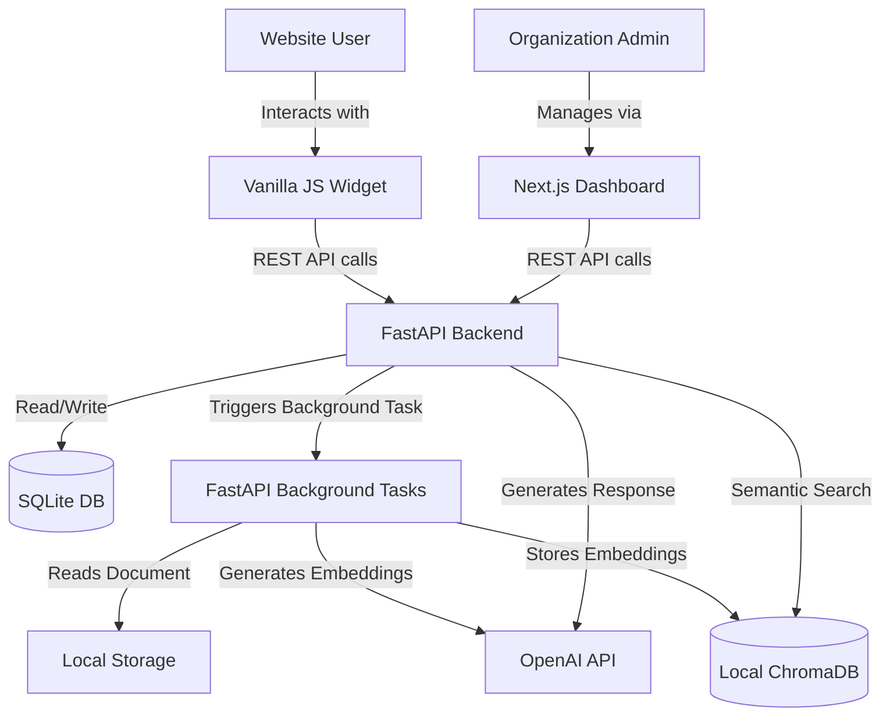

# FAQFlow AI - Full Project Documentation Report

## Executive Summary

FAQFlow AI is a comprehensive, enterprise-grade Software as a Service (SaaS) platform designed to revolutionize customer support. By leveraging advanced Retrieval-Augmented Generation (RAG) capabilities, FAQFlow AI allows organizations to upload their existing FAQ documents, manuals, and knowledge bases, and instantly generates an intelligent, conversational support chatbot. 

This chatbot can be seamlessly embedded into any website via a lightweight Vanilla JavaScript widget, providing instant, accurate, and context-aware responses to user queries. The platform is built using a modern, scalable architecture, ensuring rapid response times and secure multi-tenant data isolation.

---

## 1. System Architecture & Technology Stack

FAQFlow AI utilizes a cutting-edge full-stack architecture, separating the client-side interface, the server-side logic, background task processing, and vector database management.

### Technology Stack Overview

**Frontend (Client & Admin Dashboard):**
- **Framework:** Next.js (App Router)
- **Language:** TypeScript / React
- **Styling:** Tailwind CSS for rapid, responsive utility-first styling.
- **State Management:** React Hooks and Context API.

**Backend (API & Core Logic):**
- **Framework:** FastAPI (Python 3.10+)
- **ORM:** SQLAlchemy for relational database interactions.
- **Authentication:** JWT (JSON Web Tokens) with secure password hashing (bcrypt).
- **Architecture:** Modular RESTful API design.

**AI & RAG Engine:**
- **Framework:** Langchain for orchestrating LLM chains.
- **LLM:** OpenAI GPT-4 Turbo for generating conversational responses.
- **Embeddings:** OpenAI Embeddings (`text-embedding-ada-002` or `text-embedding-3-small`).
- **Vector Store:** ChromaDB for storing and retrieving high-dimensional document embeddings locally.

**Background Processing:**
- **Task Execution:** FastAPI Background Tasks for handling long-running operations like document parsing and embedding generation without blocking API responses.

**Database:**
- **Primary Datastore:** SQLite (`faqflow.db`) for storing user accounts, organization metadata, and chat histories locally.

### High-Level Architecture Diagram



---

## 2. Database Schema & Data Models

The relational data is managed via SQLAlchemy and SQLite. The system uses a multi-tenant model where data is partitioned by `org_id`.

### Core Entities

1. **User (`user.py`):**
   - Represents an administrator or team member of an organization.
   - Fields: `id`, `email`, `hashed_password`, `full_name`, `is_active`, `is_superuser`, `org_id`.

2. **Organization (`organization.py`):**
   - The primary tenant entity. All documents and chat logs are tied to an organization.
   - Fields: `id`, `name`, `api_key` (for widget integration), `subscription_status`.

3. **Document (`document.py`):**
   - Represents an uploaded file (PDF, TXT, DOCX) used for training the RAG pipeline.
   - Fields: `id`, `filename`, `file_path`, `status` (pending, active, failed), `org_id`, `upload_date`.

4. **Chat Session (`chat.py`):**
   - Logs the interactions between the end-user and the AI widget.
   - Fields: `id`, `session_id`, `org_id`, `created_at`.
   - Related: `ChatMessage` (individual messages within a session).

---

## 3. Backend Services & APIs

The FastAPI backend is structured modularly within `backend/app/api/endpoints/`.

### Key Endpoints

- **Auth (`/api/v1/auth/`)**:
  - `POST /login/access-token`: Authenticates a user and returns a JWT access token.
  - `POST /register`: Registers a new user and organization.

- **Users (`/api/v1/users/`)**:
  - `GET /me`: Retrieves the currently authenticated user's profile.
  - `PUT /me`: Updates user details.

- **Documents (`/api/v1/documents/`)**:
  - `POST /upload`: Accepts a multipart/form-data file upload. Saves the file locally and triggers a background task to process and index the document.
  - `GET /`: Lists all documents for the authenticated user's organization.
  - `DELETE /{id}`: Removes a document and its associated vectors from ChromaDB.

- **Chat (`/api/v1/chat/`)**:
  - `POST /completions`: The core AI endpoint. Receives a user query, performs a semantic search in ChromaDB using the organization's ID as a filter, retrieves relevant document chunks, and passes them to OpenAI to generate a contextual response.

### Asynchronous Document Processing

Document indexing is offloaded to FastAPI Background Tasks to prevent blocking the main API thread.
1. The API saves the file and creates a `Document` record with `status="pending"`.
2. The API enqueues a background task (`process_document_task`).
3. The background task reads the file, splits it into chunks using Langchain's text splitters.
4. The chunks are sent to OpenAI to generate embeddings.
5. Embeddings and metadata (including `org_id`) are stored in ChromaDB.
6. The `Document` status is updated to `active`.

---

## 4. Frontend Application

The Next.js frontend provides a sleek, premium Dashboard for users to manage their AI agents.

### Directory Structure (`frontend/src/app`)

- `/dashboard`: The authenticated area.
  - `/dashboard/chat`: Interface to test the AI chatbot internally before deploying.
  - `/dashboard/settings`: Account and API key management.
- `/login`: User authentication page.
- `/signup`: New user registration.

### Design Aesthetics
The UI is built with Tailwind CSS, focusing on a modern, "glassmorphism" aesthetic with dark modes, subtle gradients, and smooth micro-animations. It aims to provide a premium SaaS experience out-of-the-box.

---

## 5. The Embeddable Widget (`widget/faqflow.js`)

The core value proposition is the ability to embed the AI anywhere. The widget is a self-contained, Vanilla JavaScript file that injects a chat interface into the host website.

**Integration:**
```html
<script src="https://cdn.faqflow.ai/faqflow.js"></script>
<script>
  FAQFlow.init({
    apiKey: 'org_api_key_here',
    theme: 'dark',
    position: 'bottom-right'
  });
</script>
```

The widget communicates securely with the `POST /api/v1/chat/completions` endpoint, passing the `apiKey` to ensure it only queries documents belonging to the correct organization.

---

## 6. Setup & Deployment Guide

The platform is designed to be easily runnable locally.

### Local Development Setup

1. **Clone & Configure:**
   Ensure you have `.env` files in both the root/backend and frontend directories. The most critical variable is `OPENAI_API_KEY`.

2. **Start Backend (Terminal 1):**
   ```bash
   cd backend
   # Set your OPENAI_API_KEY environment variable
   uvicorn app.main:app --reload
   ```
   This spins up the FastAPI Backend (Port 8000), utilizing local SQLite and ChromaDB automatically.

3. **Start Frontend (Terminal 2):**
   ```bash
   cd frontend
   npm install
   npm run dev
   ```
   The Next.js app runs on `http://localhost:3000`.

### Production Deployment Strategy

For production, the applications can be deployed using standard PaaS providers:
- **Frontend:** Vercel, Netlify, or AWS Amplify.
- **Backend:** Render, Railway, or AWS EC2/ECS. Note: Due to SQLite and local ChromaDB usage, persistent disk storage is required. For scale, consider migrating back to PostgreSQL and a managed Vector DB (like Pinecone) if necessary.

---

## 7. Security Considerations

- **Tenant Isolation:** ChromaDB queries are strictly filtered using metadata tags (`org_id`) to ensure one company's AI cannot access another company's documents.
- **Authentication:** All admin endpoints are protected by OAuth2 with Password Bearer and JWT tokens.
- **CORS:** Cross-Origin Resource Sharing is strictly configured to only allow requests from authorized domains (the dashboard and authorized widget domains).
- **API Keys:** Widget integration uses restricted API keys rather than full user JWTs.

---

## 8. Future Roadmap

1. **Multi-Source Integration:** Syncing directly from Zendesk, Intercom, or Notion.
2. **Advanced Analytics:** Dashboard charts showing chat volume, user sentiment, and unanswered queries.
3. **Human Handoff:** Allowing the AI to escalate complex queries to a live human agent via websockets.
4. **Custom Prompting:** Allowing admins to define the chatbot's persona (e.g., "Be highly technical", "Be friendly and use emojis").

---
*Report Generated Automatically by AI Assistant.*
